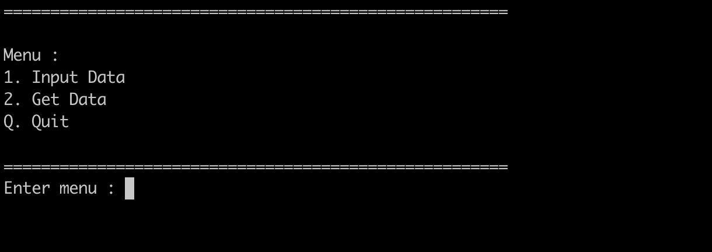
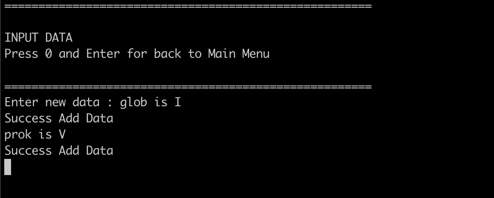
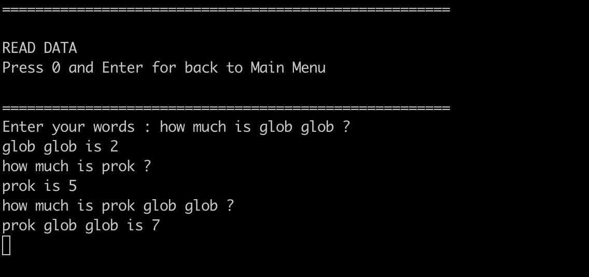

## Roman number to integer

### Requirements

    - Git
    - Golang

### Running

1. Clone this repository:

   ```
   git clone https://github.com/okaaryanata/roman-number-to-integer
   ```

2. cd into the repository

- **Run TDD**

  Run this command on your terminal :

  ```
  go test -v ./convert
  ```

- **Run program**

  Run this command on your terminal :

  ```
  go run main.go
  ```

  This program have 2 menu :
  
  
  
  
  **1. Input data** : on this menu you can add your data
  
  
  
  example :

  - Add alias for roman number
  
    ```
    glob is I
    prok is V
    pish is X
    tegj is L
    ```
    
    The format for this section is :
    `{alias_name} is {roman_number}`
    
    
  - Add credits for Metal and Dirt
  
    ```
    glob glob Silver is 34 Credits
    glob prok Gold is 57800 Credits
    pish pish Iron is 3910 Credits
    ```
    
    The format for this section is :
    `{alias_name_that_was_entered_before} {Metal/Dirt_name} is {credit_value} credits`
    

  **2. Get data** : on this menu you can add your data
  
  
  
  example :

  - Get value from **roman_alias** that you make before
  
    ```
    how much is pish tegj glob glob ?
    ```
    
    The format for this section is :
    `how much is {alias_name} ?`
    
    
  - Get credit value from **roman_alias** and **metal/dirt_name** that you make before
  
    ```
    how many Credits is glob prok Silver ?
    how many Credits is glob prok Gold ?
    how many Credits is glob prok Iron ?
    ```
    
    The format for this section is :
    `how many credits is {alias_name} {Metal/Dirt_name} ?`
    
    
